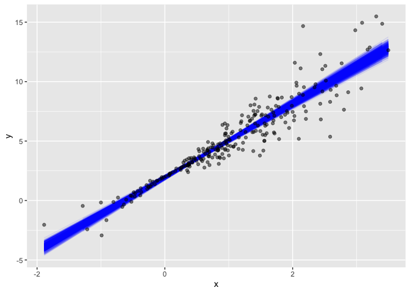
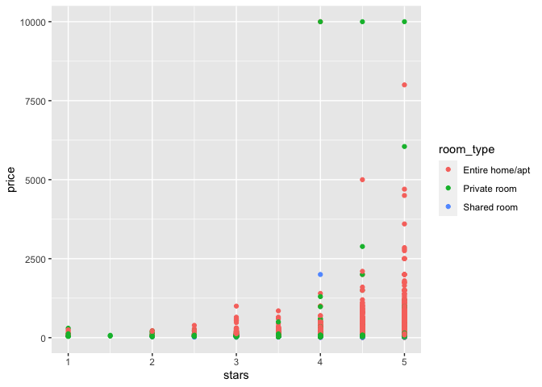
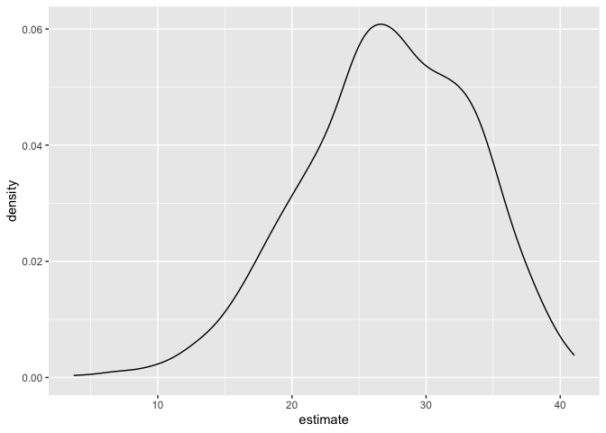

Bootstrapping
================

``` r
library(tidyverse)
```

    ## ── Attaching core tidyverse packages ──────────────────────── tidyverse 2.0.0 ──
    ## ✔ dplyr     1.1.3     ✔ readr     2.1.4
    ## ✔ forcats   1.0.0     ✔ stringr   1.5.0
    ## ✔ ggplot2   3.4.3     ✔ tibble    3.2.1
    ## ✔ lubridate 1.9.2     ✔ tidyr     1.3.0
    ## ✔ purrr     1.0.2     
    ## ── Conflicts ────────────────────────────────────────── tidyverse_conflicts() ──
    ## ✖ dplyr::filter() masks stats::filter()
    ## ✖ dplyr::lag()    masks stats::lag()
    ## ℹ Use the conflicted package (<http://conflicted.r-lib.org/>) to force all conflicts to become errors

``` r
library(modelr)
library(p8105.datasets)
```

``` r
set.seed(1)
```

## Generate a relevant example:

Let’s create some simulated data. First I’ll generate x, then an error
sampled from a normal distribution, and then a response y; this all gets
stored in sim_df_const. Then I’ll modify this by multiplying the errors
by a term that involves x, and create a new response variable y.

``` r
n_samp = 250

sim_df_const = 
  tibble(
    x = rnorm(n_samp, 1, 1),
    error = rnorm(n_samp, 0, 1),
    y = 2 + 3 * x + error
  )

sim_df_nonconst = sim_df_const %>% 
  mutate(
  error = error * .75 * x,
  y = 2 + 3 * x + error
)
```

By generating data in this way, I’m creating one case in which the usual
linear regression assumptions hold and one case in which they don’t.

The plot below illustrates the differences between the dataset:

``` r
sim_df = 
  bind_rows(const = sim_df_const, nonconst = sim_df_nonconst, .id = "data_source") 

sim_df |> 
  ggplot(aes(x = x, y = y)) + 
  geom_point(alpha = .5) +
  stat_smooth(method = "lm") +
  facet_grid(~data_source) 
```

    ## `geom_smooth()` using formula = 'y ~ x'

<!-- --> These
datasets have roughly the same overall variance, but the left panel
shows data with constant variance and the right panel shows data with
non-constant variance. For this reason, ordinary least squares should
provide reasonable estimates in both cases, but inference is standard
inference approaches may only be justified for the data on the left.

The output below shows results from fitting simple linear regressions to
both datasets:

``` r
lm(y ~ x, data = sim_df_const) |> 
  broom::tidy() |> 
  knitr::kable(digits = 3)
```

| term        | estimate | std.error | statistic | p.value |
|:------------|---------:|----------:|----------:|--------:|
| (Intercept) |    1.977 |     0.098 |    20.157 |       0 |
| x           |    3.045 |     0.070 |    43.537 |       0 |

Despite the very different error structures, standard errors for
coefficient estimates are similar in both cases! – We’ll use the
bootstrap to make inference for the data on the right. This is intended
largely as an illustration for how to use the bootstrap in cases where
the theoretical distribution is “unknown”, although for these data in
particular weighted least squares could be more appropriate.

# Drawing one bootstrap sample

Let’s write a quick function to generate our bootstrap samples. This
function should have the data frame as the argument, and should return a
sample from that dataframe drawn with replacement.

``` r
boot_sample = function(df) {
  sample_frac(df, replace = TRUE)
}
```

Lets see how this works:

``` r
boot_sample(sim_df_nonconst) |> 
  ggplot(aes(x = x, y = y)) + 
  geom_point(alpha = .5) +
  stat_smooth(method = "lm")
```

    ## `geom_smooth()` using formula = 'y ~ x'

<!-- --> This
plot looks about right. In comparison with the original data, the
bootstrap sample has the same characteristics but isn’t a perfect
duplicate – some original data points appear more than once, others
don’t appear at all.

# Drawing many bootstrap samples

We’re going to draw repeated samples with replacement, and then analyze
each of those samples separately. It would be really great to have a
data structure that makes it possible to keep track of everything. Like
a list column!!!

Lets give it a try:

``` r
boot_straps = 
  tibble(strap_number = 1:1000) |> 
  mutate(
    strap_sample = map(strap_number, \(i) boot_sample(df = sim_df_nonconst))
  )

boot_straps
```

    ## # A tibble: 1,000 × 2
    ##    strap_number strap_sample      
    ##           <int> <list>            
    ##  1            1 <tibble [250 × 3]>
    ##  2            2 <tibble [250 × 3]>
    ##  3            3 <tibble [250 × 3]>
    ##  4            4 <tibble [250 × 3]>
    ##  5            5 <tibble [250 × 3]>
    ##  6            6 <tibble [250 × 3]>
    ##  7            7 <tibble [250 × 3]>
    ##  8            8 <tibble [250 × 3]>
    ##  9            9 <tibble [250 × 3]>
    ## 10           10 <tibble [250 × 3]>
    ## # ℹ 990 more rows

We can do a few of quick checks to make sure this has worked as
intended. First we’ll look at a couple of bootstrap samples:

``` r
boot_straps |> 
  slice(1:3) |> 
  mutate(strap_sample = map(strap_sample, arrange, x)) |> 
  pull(strap_sample)
```

    ## [[1]]
    ## # A tibble: 250 × 3
    ##         x   error       y
    ##     <dbl>   <dbl>   <dbl>
    ##  1 -1.89   1.62   -2.04  
    ##  2 -1.89   1.62   -2.04  
    ##  3 -1.21  -0.781  -2.43  
    ##  4 -1.21  -0.781  -2.43  
    ##  5 -1.00   0.832  -0.169 
    ##  6 -0.989 -1.97   -2.93  
    ##  7 -0.914 -0.908  -1.65  
    ##  8 -0.606 -0.106   0.0774
    ##  9 -0.536  0.0227  0.413 
    ## 10 -0.524 -0.536  -0.106 
    ## # ℹ 240 more rows
    ## 
    ## [[2]]
    ## # A tibble: 250 × 3
    ##         x  error       y
    ##     <dbl>  <dbl>   <dbl>
    ##  1 -1.29   1.40  -0.454 
    ##  2 -0.989 -1.97  -2.93  
    ##  3 -0.914 -0.908 -1.65  
    ##  4 -0.914 -0.908 -1.65  
    ##  5 -0.805  0.292 -0.123 
    ##  6 -0.805  0.292 -0.123 
    ##  7 -0.665 -0.544 -0.539 
    ##  8 -0.641 -0.416 -0.338 
    ##  9 -0.606 -0.106  0.0774
    ## 10 -0.606 -0.106  0.0774
    ## # ℹ 240 more rows
    ## 
    ## [[3]]
    ## # A tibble: 250 × 3
    ##         x  error      y
    ##     <dbl>  <dbl>  <dbl>
    ##  1 -1.89   1.62  -2.04 
    ##  2 -1.89   1.62  -2.04 
    ##  3 -1.29   1.40  -0.454
    ##  4 -1.29   1.40  -0.454
    ##  5 -1.00   0.832 -0.169
    ##  6 -0.914 -0.908 -1.65 
    ##  7 -0.805  0.292 -0.123
    ##  8 -0.665 -0.544 -0.539
    ##  9 -0.665 -0.544 -0.539
    ## 10 -0.665 -0.544 -0.539
    ## # ℹ 240 more rows

This seems okay – some values are repeated, some don’t appear in both
datasets.

Next I’ll use ggplot to show some of these datasets, and to include a
linear fit for each:

``` r
boot_straps |> 
  slice(1:3) |> 
  unnest(strap_sample) |> 
  ggplot(aes(x = x, y = y)) + 
  geom_point(alpha = .5) +
  stat_smooth(method = "lm", se = FALSE) +
  facet_grid(~strap_number) 
```

    ## `geom_smooth()` using formula = 'y ~ x'

<!-- --> This
shows some of the differences across bootstrap samples, and shows that
the fitted regression lines aren’t the same for every bootstrap sample.

# Analyzing bootstrap samples

My goal, of course, isn’t to analyze bootstrap samples by plotting them
– I’d like to get a sense of the variability in estimated intercepts and
slopes across all my bootstrap samples.

To do that, I’ll use the analytic pipeline we established when looking
at nested datasets in linear models: fit the model; tidy the output;
unnest and examine the results. The code chunk below uses this pipeline
to look at bootstrap standard errors for the estimated regression
coefficients.

``` r
bootstrap_results = 
  boot_straps |> 
  mutate(
    models = map(strap_sample, \(df) lm(y ~ x, data = df) ),
    results = map(models, broom::tidy)) |> 
  select(-strap_sample, -models) |> 
  unnest(results) 

bootstrap_results |> 
  group_by(term) |> 
  summarize(boot_se = sd(estimate)) |> 
  knitr::kable(digits = 3)
```

| term        | boot_se |
|:------------|--------:|
| (Intercept) |   0.075 |
| x           |   0.101 |

Comparing these to the results of ordinary least squares, the standard
error for the intercept is much smaller and the standard error for the
intercept is a bit larger. This is reasonable, given the non-constant
variance in the data given smaller residuals around zero and larger
residuals in the the tails of the x distribution.

I can also use the estimates across bootstrap samples to construct a
confidence interval. For a 95% CI, we might try to exclude the lower and
upper 2.5% of the distribution of parameter estimates across “repeated”
samples. The code below will do that:

``` r
bootstrap_results |> 
  group_by(term) |> 
  summarize(
    ci_lower = quantile(estimate, 0.025), 
    ci_upper = quantile(estimate, 0.975))
```

    ## # A tibble: 2 × 3
    ##   term        ci_lower ci_upper
    ##   <chr>          <dbl>    <dbl>
    ## 1 (Intercept)     1.79     2.08
    ## 2 x               2.91     3.31

For a simple linear regression, we can show the fitted lines for each
bootstrap sample to build intuition for these results:

``` r
boot_straps |> 
  unnest(strap_sample) |> 
  ggplot(aes(x = x, y = y)) + 
  geom_line(aes(group = strap_number), stat = "smooth", method = "lm", se = FALSE, alpha = .1, color = "blue") +
  geom_point(data = sim_df_nonconst, alpha = .5)
```

    ## `geom_smooth()` using formula = 'y ~ x'

<!-- --> – In
comparison to the standard error bands in our previous plot (which are
based on OLS), the distribution of regression lines is narrower near x=0
and wider at the ends of the x distribution.

# Modelr::bootstrap

Bootstrapping is common enough that it’s been automated, to some degree,
in the modelr::boostrap function. This function makes it easy to draw
bootstrap samples, and stores them in a mostly-helpful way – as a
resample object that can be converted to and treated like a data frame.
(This keeps you from having to actually store 1000 dataframes, and saves
a lot of memory on your computer.)

``` r
boot_straps = 
  sim_df_nonconst |> 
  modelr::bootstrap(n = 1000)

boot_straps |> pull(strap) |> nth(1)
```

    ## <resample [250 x 3]> 8, 132, 69, 225, 180, 122, 34, 170, 216, 122, ...

``` r
boot_straps |> pull(strap) |> nth(1) |> as_tibble()
```

    ## # A tibble: 250 × 3
    ##         x  error     y
    ##     <dbl>  <dbl> <dbl>
    ##  1  1.74   0.747  7.96
    ##  2  0.411  0.343  3.58
    ##  3  1.15  -1.12   4.34
    ##  4 -0.157 -0.159  1.37
    ##  5  2.21  -1.13   7.50
    ##  6  2.34   0.488  9.52
    ##  7  0.946 -0.498  4.34
    ##  8  1.21   1.55   7.17
    ##  9  2.52   0.528 10.1 
    ## 10  2.34   0.488  9.52
    ## # ℹ 240 more rows

Let’s repeat our analysis pipeline using the bootstrap function instead
of our own process for drawing samples with replacement:

``` r
sim_df_nonconst |> 
  modelr::bootstrap(n = 1000) |> 
  mutate(
    models = map(strap, \(df) lm(y ~ x, data = df) ),
    results = map(models, broom::tidy)) |> 
  select(-strap, -models) |> 
  unnest(results) |> 
  group_by(term) |> 
  summarize(boot_se = sd(estimate))
```

    ## # A tibble: 2 × 2
    ##   term        boot_se
    ##   <chr>         <dbl>
    ## 1 (Intercept)  0.0790
    ## 2 x            0.104

The results are the same (up to resampling variability), and the code to
get here is pretty clean.

Also, check this out – to bootstrap the dataset with constant error
variance, we only have to change the input dataframe!

``` r
sim_df_const |> 
  modelr::bootstrap(n = 1000) |> 
  mutate(
    models = map(strap, \(df) lm(y ~ x, data = df)),
    results = map(models, broom::tidy)) |> 
  select(-strap, -models) |> 
  unnest(results) |> 
  group_by(term) |> 
  summarize(boot_se = sd(estimate))
```

    ## # A tibble: 2 × 2
    ##   term        boot_se
    ##   <chr>         <dbl>
    ## 1 (Intercept)  0.101 
    ## 2 x            0.0737

–These results generally agree with the output of the OLS procedure,
which is nice.

# Example using Airbnb data

As a final example, we’ll revisit the Airbnb data. The code chunk below
loads and tidies the data:

``` r
data("nyc_airbnb")

nyc_airbnb = 
  nyc_airbnb |> 
  mutate(stars = review_scores_location / 2) |> 
  rename(
    borough = neighbourhood_group,
    neighborhood = neighbourhood) |> 
  filter(borough != "Staten Island") |> 
  drop_na(price, stars) |> 
  select(price, stars, borough, neighborhood, room_type)
```

I’ll make a quick plot showing these data, with particular emphasis on
the features I’m interested in analyzing: price as an outcome with stars
and room_type as covariates.

``` r
nyc_airbnb |> 
  ggplot(aes(x = stars, y = price, color = room_type)) + 
  geom_point() 
```

<!-- -->

In this plot (and in linear models, we noticed that some large outliers
in price might affect estimates and inference for the association
between star rating and price. Because estimates are likely to be
sensitive to those outliers and “usual” rules for inference may not
apply, the code chunk below uses the bootstrap to examine the
distribution of regression coefficients under repeated sampling:

``` r
nyc_airbnb |> 
  filter(borough == "Manhattan") |> 
  modelr::bootstrap(n = 1000) |> 
  mutate(
    models = map(strap, \(df) lm(price ~ stars + room_type, data = df)),
    results = map(models, broom::tidy)) |> 
  select(results) |> 
  unnest(results) |> 
  filter(term == "stars") |> 
  ggplot(aes(x = estimate)) + geom_density()
```

<!-- --> –
This distribution has a heavy tail extending to low values and a bit of
a “shoulder”, features that may be related to the frequency with which
large outliers are included in the bootstrap sample.
