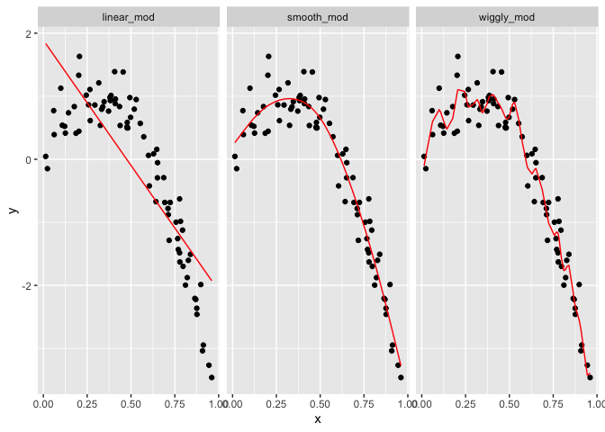

Cross Validation
================

``` r
library(tidyverse)
```

    ## ── Attaching core tidyverse packages ──────────────────────── tidyverse 2.0.0 ──
    ## ✔ dplyr     1.1.3     ✔ readr     2.1.4
    ## ✔ forcats   1.0.0     ✔ stringr   1.5.0
    ## ✔ ggplot2   3.4.3     ✔ tibble    3.2.1
    ## ✔ lubridate 1.9.2     ✔ tidyr     1.3.0
    ## ✔ purrr     1.0.2     
    ## ── Conflicts ────────────────────────────────────────── tidyverse_conflicts() ──
    ## ✖ dplyr::filter() masks stats::filter()
    ## ✖ dplyr::lag()    masks stats::lag()
    ## ℹ Use the conflicted package (<http://conflicted.r-lib.org/>) to force all conflicts to become errors

``` r
library(modelr)
library(mgcv)
```

    ## Loading required package: nlme
    ## 
    ## Attaching package: 'nlme'
    ## 
    ## The following object is masked from 'package:dplyr':
    ## 
    ##     collapse
    ## 
    ## This is mgcv 1.9-0. For overview type 'help("mgcv-package")'.

``` r
set.seed(1)
```

``` r
nonlin_df = 
  tibble(
    id = 1:100,
    x = runif(100, 0, 1),
    y = 1 - 10 * (x - .3) ^ 2 + rnorm(100, 0, .3)
  )

nonlin_df |> 
  ggplot(aes(x = x, y = y)) + 
  geom_point()
```

<!-- -->

Do the Train / Test split:

``` r
train_df = sample_n(nonlin_df, 80)
test_df = anti_join(nonlin_df, train_df, by = "id")

ggplot(train_df, aes(x = x, y = y)) + 
  geom_point() + 
  geom_point(data = test_df, color = "red")
```

<!-- --> –
Here I have split this data into training and test sets (using
anti_join!!), and replot showing the split. Our goal will be to use the
training data (in black) to build candidate models, and then see how
those models predict in the testing data (in red).

I’ll fit three three models to the training data. Throughout, I’m going
to use mgcv::gam for non-linear models – this is my go-to package for
“additive models”, and I much prefer it to e.g. polynomial models. For
today, you don’t have to know what this means, how gam works, or why I
prefer it – just know that we’re putting smooth lines through data
clouds, and we can control how smooth we want the fit to be.

``` r
linear_mod = lm(y ~ x, data = train_df)
smooth_mod = mgcv::gam(y ~ s(x), data = train_df)
wiggly_mod = mgcv::gam(y ~ s(x, k = 30), sp = 10e-6, data = train_df)
```

The three models above have very different levels of complexity and
aren’t nested, so testing approaches for nested model don’t apply.

To understand what these models have done, I’ll plot the two gam fits:

``` r
train_df |> 
  add_predictions(smooth_mod) |> 
  ggplot(aes(x = x, y = y)) + geom_point() + 
  geom_line(aes(y = pred), color = "red")
```

<!-- -->

``` r
train_df |> 
  add_predictions(wiggly_mod) |> 
  ggplot(aes(x = x, y = y)) + geom_point() + 
  geom_line(aes(y = pred), color = "red")
```

<!-- -->

In a case like this, I can also use the handy modelr::gather_predictions
function – this is, essentially, a short way of adding predictions for
several models to a data frame and then “pivoting” so the result is a
tidy, “long” dataset that’s easily plottable:

``` r
train_df |> 
  gather_predictions(linear_mod, smooth_mod, wiggly_mod) |> 
  mutate(model = fct_inorder(model)) |> 
  ggplot(aes(x = x, y = y)) + 
  geom_point() + 
  geom_line(aes(y = pred), color = "red") + 
  facet_wrap(~model)
```

<!-- --> –\>
A quick visual inspection suggests that the linear model is too simple,
the standard gam fit is pretty good, and the wiggly gam fit is too
complex. Put differently, the linear model is too simple and, no matter
what training data we use, will never capture the true relationship
between variables – it will be consistently wrong due to its simplicity,
and is therefore biased. The wiggly fit, on the other hand, is chasing
data points and will change a lot from one training dataset to the the
next – it will be consistently wrong due to its complexity, and is
therefore highly variable. Both are bad!

As a next step in my CV procedure, I’ll compute root mean squared errors
(RMSEs) for each model:

``` r
## RMSE on training data can be misleading 
rmse(linear_mod, train_df)
```

    ## [1] 0.7178747

``` r
rmse(smooth_mod, train_df)
```

    ## [1] 0.2874834

``` r
rmse(wiggly_mod, train_df)
```

    ## [1] 0.2498309

``` r
## RMSE on Testing data gives a sense of out of sample prediction accuracy!
rmse(linear_mod, test_df)
```

    ## [1] 0.7052956

``` r
rmse(smooth_mod, test_df)
```

    ## [1] 0.2221774

``` r
rmse(wiggly_mod, test_df)
```

    ## [1] 0.289051

– The modelr has other outcome measures – RMSE is the most common, but
median absolute deviation is pretty common as well. – The RMSEs are
suggestive that both nonlinear models work better than the linear model,
and that the smooth fit is better than the wiggly fit. However, to get a
sense of model stability we really need to iterate this whole process.
Of course, this could be done using loops but that’s a hassle …

# CV using modelr

Luckily, modelr has tools to automate elements of the CV process. In
particular, crossv_mc preforms the training / testing split multiple
times, a stores the datasets using list columns:

``` r
cv_df = 
  crossv_mc(nonlin_df, 100) 
```

crossv_mc tries to be smart about memory – rather than repeating the
dataset a bunch of times, it saves the data once and stores the indexes
for each training / testing split using a resample object. This can be
coerced to a dataframe, and can often be treated exactly like a
dataframe. However, it’s not compatible with gam, so we have to convert
each training and testing dataset (and lose that nice memory-saving
stuff in the process) using the code below. It’s worth noting, though,
that if all the models you want to fit use lm, you can skip this.

``` r
cv_df |> pull(train) |> nth(1) |> as_tibble()
```

    ## # A tibble: 79 × 3
    ##       id      x       y
    ##    <int>  <dbl>   <dbl>
    ##  1     1 0.266   1.11  
    ##  2     2 0.372   0.764 
    ##  3     3 0.573   0.358 
    ##  4     4 0.908  -3.04  
    ##  5     6 0.898  -1.99  
    ##  6     7 0.945  -3.27  
    ##  7     8 0.661  -0.615 
    ##  8     9 0.629   0.0878
    ##  9    10 0.0618  0.392 
    ## 10    11 0.206   1.63  
    ## # ℹ 69 more rows

``` r
cv_df |> pull(test) |> nth(1) |> as_tibble()
```

    ## # A tibble: 21 × 3
    ##       id      x      y
    ##    <int>  <dbl>  <dbl>
    ##  1     5 0.202   1.33 
    ##  2    12 0.177   0.836
    ##  3    19 0.380   0.982
    ##  4    22 0.212   0.710
    ##  5    28 0.382   0.932
    ##  6    31 0.482   0.498
    ##  7    37 0.794  -1.12 
    ##  8    42 0.647   0.158
    ##  9    47 0.0233 -0.148
    ## 10    56 0.0995  1.13 
    ## # ℹ 11 more rows

``` r
cv_df =
  cv_df |> 
  mutate(
    train = map(train, as_tibble),
    test = map(test, as_tibble))
```
