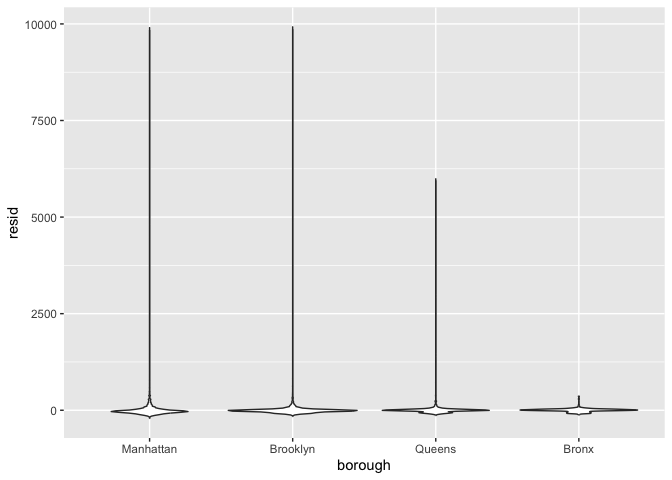

Linear Regression
================

``` r
library(tidyverse)
```

    ## ── Attaching core tidyverse packages ──────────────────────── tidyverse 2.0.0 ──
    ## ✔ dplyr     1.1.3     ✔ readr     2.1.4
    ## ✔ forcats   1.0.0     ✔ stringr   1.5.0
    ## ✔ ggplot2   3.4.3     ✔ tibble    3.2.1
    ## ✔ lubridate 1.9.2     ✔ tidyr     1.3.0
    ## ✔ purrr     1.0.2     
    ## ── Conflicts ────────────────────────────────────────── tidyverse_conflicts() ──
    ## ✖ dplyr::filter() masks stats::filter()
    ## ✖ dplyr::lag()    masks stats::lag()
    ## ℹ Use the conflicted package (<http://conflicted.r-lib.org/>) to force all conflicts to become errors

``` r
library(p8105.datasets)
```

# Load and clean the Airbnb Data

``` r
data("nyc_airbnb")

nyc_airbnb = 
  nyc_airbnb |> 
  mutate(stars = review_scores_location / 2) |> 
  rename(
    borough = neighbourhood_group,
    neighborhood = neighbourhood) |> 
  filter(borough != "Staten Island") |> 
  select(price, stars, borough, neighborhood, room_type)
```

# Lets fit a Model:

– A good place to start is to consider price as an outcome that may
depend on rating and borough. We fit that initial model in the following
code.

``` r
fit = lm(price ~ stars + borough, data = nyc_airbnb)

nyc_airbnb = 
  nyc_airbnb |> 
  mutate(
    borough = fct_infreq(borough),
    room_type = fct_infreq(room_type))

fit = lm(price ~ stars + borough, data = nyc_airbnb)
```

– The lm function begins with the formula specification – outcome on the
left of the ~ and predictors separated by + on the right. As we’ll see
shortly, interactions between variables can be specified using \*. You
can also specify an intercept-only model (outcome ~ 1), a model with no
intercept (outcome ~ 0 + …), and a model using all available predictors
(outcome ~ .).

– R will treat categorical (factor) covariates appropriately and
predictably: indicator variables are created for each non-reference
category and included in your model, and the factor level is treated as
the reference. As with ggplot, being careful with factors is therefore
critical!

Lets look at the fit:

``` r
summary(fit)
```

    ## 
    ## Call:
    ## lm(formula = price ~ stars + borough, data = nyc_airbnb)
    ## 
    ## Residuals:
    ##    Min     1Q Median     3Q    Max 
    ## -169.8  -64.0  -29.0   20.2 9870.0 
    ## 
    ## Coefficients:
    ##                 Estimate Std. Error t value Pr(>|t|)    
    ## (Intercept)       19.839     12.189   1.628    0.104    
    ## stars             31.990      2.527  12.657   <2e-16 ***
    ## boroughBrooklyn  -49.754      2.235 -22.262   <2e-16 ***
    ## boroughQueens    -77.048      3.727 -20.675   <2e-16 ***
    ## boroughBronx     -90.254      8.567 -10.534   <2e-16 ***
    ## ---
    ## Signif. codes:  0 '***' 0.001 '**' 0.01 '*' 0.05 '.' 0.1 ' ' 1
    ## 
    ## Residual standard error: 181.5 on 30525 degrees of freedom
    ##   (9962 observations deleted due to missingness)
    ## Multiple R-squared:  0.03423,    Adjusted R-squared:  0.03411 
    ## F-statistic: 270.5 on 4 and 30525 DF,  p-value: < 2.2e-16

``` r
summary(fit)$coeff
```

    ##                  Estimate Std. Error    t value      Pr(>|t|)
    ## (Intercept)      19.83946  12.189256   1.627619  1.036160e-01
    ## stars            31.98989   2.527500  12.656733  1.269392e-36
    ## boroughBrooklyn -49.75363   2.234878 -22.262345 6.317605e-109
    ## boroughQueens   -77.04776   3.726632 -20.674904  2.584908e-94
    ## boroughBronx    -90.25393   8.567490 -10.534465  6.638618e-26

Dont do those things ^ instead - Tidy up the output!

The output of a lm is an object of class lm – a very specific list that
isn’t a dataframe but that can be manipulated using other functions.
Some common functions for interacting with lm fits are below, although
we omit the output.

``` r
fit %>% 
  broom::glance()
```

    ## # A tibble: 1 × 12
    ##   r.squared adj.r.squared sigma statistic   p.value    df   logLik    AIC    BIC
    ##       <dbl>         <dbl> <dbl>     <dbl>     <dbl> <dbl>    <dbl>  <dbl>  <dbl>
    ## 1    0.0342        0.0341  182.      271. 6.73e-229     4 -202113. 4.04e5 4.04e5
    ## # ℹ 3 more variables: deviance <dbl>, df.residual <int>, nobs <int>

- glance gives you a high level look at the model – comparing lots of
  models this is helpful The broom package has functions for obtaining a
  quick summary of the model and for cleaning up the coefficient table.

Tidy up the coefficients:

``` r
fit %>% 
  broom::tidy() %>% 
  mutate(term = str_replace(term, "^borough", "Borough: ")) %>% 
  knitr::kable(digits = 3)
```

| term              | estimate | std.error | statistic | p.value |
|:------------------|---------:|----------:|----------:|--------:|
| (Intercept)       |   19.839 |    12.189 |     1.628 |   0.104 |
| stars             |   31.990 |     2.527 |    12.657 |   0.000 |
| Borough: Brooklyn |  -49.754 |     2.235 |   -22.262 |   0.000 |
| Borough: Queens   |  -77.048 |     3.727 |   -20.675 |   0.000 |
| Borough: Bronx    |  -90.254 |     8.567 |   -10.534 |   0.000 |

- broom tidy makes anything into a tibble – very useful Both of these
  functions produce data frames, which makes it straightforward to
  include the results in subsequent steps. – As an aside, broom::tidy
  works with lots of things, including most of the functions for model
  fitting you’re likely to run into (survival, mixed models, additive
  models, …).

# Fit another model

``` r
  nyc_airbnb %>% 
  mutate(
    borough = fct_infreq(borough),
    room_type = fct_infreq(room_type))
```

    ## # A tibble: 40,492 × 5
    ##    price stars borough neighborhood room_type      
    ##    <dbl> <dbl> <fct>   <chr>        <fct>          
    ##  1    99   5   Bronx   City Island  Private room   
    ##  2   200  NA   Bronx   City Island  Private room   
    ##  3   300  NA   Bronx   City Island  Entire home/apt
    ##  4   125   5   Bronx   City Island  Entire home/apt
    ##  5    69   5   Bronx   City Island  Private room   
    ##  6   125   5   Bronx   City Island  Entire home/apt
    ##  7    85   5   Bronx   City Island  Entire home/apt
    ##  8    39   4.5 Bronx   Allerton     Private room   
    ##  9    95   5   Bronx   Allerton     Entire home/apt
    ## 10   125   4.5 Bronx   Allerton     Entire home/apt
    ## # ℹ 40,482 more rows

``` r
fit = lm(price ~ stars + borough + room_type, data = nyc_airbnb)

fit %>% 
  broom::tidy()
```

    ## # A tibble: 7 × 5
    ##   term                  estimate std.error statistic  p.value
    ##   <chr>                    <dbl>     <dbl>     <dbl>    <dbl>
    ## 1 (Intercept)              113.      11.8       9.54 1.56e-21
    ## 2 stars                     21.9      2.43      9.01 2.09e-19
    ## 3 boroughBrooklyn          -40.3      2.15    -18.8  4.62e-78
    ## 4 boroughQueens            -55.5      3.59    -15.4  1.32e-53
    ## 5 boroughBronx             -63.0      8.22     -7.67 1.76e-14
    ## 6 room_typePrivate room   -105.       2.05    -51.2  0       
    ## 7 room_typeShared room    -129.       6.15    -21.0  2.24e-97

## Quick look at Regression Diagostics

- mostly boils down to get the residuals and examine them to make sure
  you dont have any overly skewed/non normal distributions in the
  residuals – Regression diagnostics can identify issues in model fit,
  especially related to certain failures in model assumptions. Examining
  residuals and fitted values are therefore an imporant component of any
  modeling exercise. –The modelr package can be used to add residuals
  and fitted values to a dataframe.

``` r
nyc_airbnb %>% 
  modelr::add_residuals(fit) %>% 
  ggplot(aes(x = resid)) +
  geom_density() +
  xlim(-100, 500)
```

    ## Warning: Removed 11681 rows containing non-finite values (`stat_density()`).

<!-- -->

``` r
nyc_airbnb %>% 
  modelr::add_residuals(fit) %>% 
  ggplot(aes(x = borough, y = resid)) +
  geom_violin() 
```

    ## Warning: Removed 9962 rows containing non-finite values (`stat_ydensity()`).

<!-- -->

``` r
nyc_airbnb %>% 
  modelr::add_residuals(fit) %>% 
  ggplot(aes(x = stars, y = resid)) +
  geom_point() 
```

    ## Warning: Removed 9962 rows containing missing values (`geom_point()`).

<!-- -->
\*\* you can fit a model on one dataset and then use the model on
another dataset to see how it works – This example has some obvious
issues, most notably the presence of extremely large outliers in price
and a generally skewed residual distribution. There are a few things we
might try to do here – including creating a formal rule for the
exclusion of outliers, transforming the price variable (e.g. using a log
transformation), or fitting a model that is robust to outliers. Dealing
with these issues isn’t really the purpose of this class, though, so
we’ll note the issues and move on; shortly we’ll look at using the
bootstrap for inference in cases like this, where standard approaches to
inference may fail.

– (For what it’s worth, I’d probably use a combination of median
regression, which is less sensitive to outliers than OLS, and maybe
bootstrapping for inference. If that’s not feasible, I’d omit rentals
with price over \$1000 (\< 0.5% of the sample) from the primary analysis
and examine these separately. I usually avoid transforming the outcome,
because the results model is difficult to interpret.)

## Hypothesis test for a categorical predictor

lets fit a Null and Alternative Hypothesis model

``` r
fit_null = lm(price ~ stars + borough, data = nyc_airbnb)
fit_alt = lm(price ~ stars + borough + room_type, data = nyc_airbnb)

anova(fit_null, fit_alt) %>% 
  broom::tidy()
```

    ## # A tibble: 2 × 7
    ##   term                        df.residual    rss    df   sumsq statistic p.value
    ##   <chr>                             <dbl>  <dbl> <dbl>   <dbl>     <dbl>   <dbl>
    ## 1 price ~ stars + borough           30525 1.01e9    NA NA            NA       NA
    ## 2 price ~ stars + borough + …       30523 9.21e8     2  8.42e7     1394.       0

Note that this works for nested models only. Comparing non-nested models
is a common problem that requires other methods; we’ll see one approach
in cross validation.

Testing multiple coefficients is somewhat more complicated. A useful
approach is to use nested models, meaning that the terms in a simple
“null” model are a subset of the terms in a more complex “alternative”
model. The are formal tests for comparing the null and alternative
models, even when several coefficients are added in the alternative
model. Tests of this kind are required to assess the significance of a
categorical predictor with more than two levels, as in the example
below.

## Nesting Data: Borough-Level Differences

``` r
fit =  lm(price ~ stars * borough + room_type * borough, data = nyc_airbnb) 

fit %>% 
  broom::tidy()
```

    ## # A tibble: 16 × 5
    ##    term                                  estimate std.error statistic  p.value
    ##    <chr>                                    <dbl>     <dbl>     <dbl>    <dbl>
    ##  1 (Intercept)                              95.7      19.2     4.99   6.13e- 7
    ##  2 stars                                    27.1       3.96    6.84   8.20e-12
    ##  3 boroughBrooklyn                         -26.1      25.1    -1.04   2.99e- 1
    ##  4 boroughQueens                            -4.12     40.7    -0.101  9.19e- 1
    ##  5 boroughBronx                             -5.63     77.8    -0.0723 9.42e- 1
    ##  6 room_typePrivate room                  -124.        3.00  -41.5    0       
    ##  7 room_typeShared room                   -154.        8.69  -17.7    1.42e-69
    ##  8 stars:boroughBrooklyn                    -6.14      5.24   -1.17   2.41e- 1
    ##  9 stars:boroughQueens                     -17.5       8.54   -2.04   4.09e- 2
    ## 10 stars:boroughBronx                      -22.7      17.1    -1.33   1.85e- 1
    ## 11 boroughBrooklyn:room_typePrivate room    32.0       4.33    7.39   1.55e-13
    ## 12 boroughQueens:room_typePrivate room      54.9       7.46    7.37   1.81e-13
    ## 13 boroughBronx:room_typePrivate room       71.3      18.0     3.96   7.54e- 5
    ## 14 boroughBrooklyn:room_typeShared room     47.8      13.9     3.44   5.83e- 4
    ## 15 boroughQueens:room_typeShared room       58.7      17.9     3.28   1.05e- 3
    ## 16 boroughBronx:room_typeShared room        83.1      42.5     1.96   5.03e- 2

We need to fit 4 models (1 for each borough):

``` r
## Create the airbnb_lm function for next step
airbnb_lm = function(df) {
  lm(price ~ stars + room_type, data = df)
}

nyc_airbnb %>% 
  nest(df = -borough) %>% 
  mutate(
    models = map(df, airbnb_lm),
    results = map(models, broom::tidy)
  ) %>% 
  select(borough, results) %>% 
  unnest(results) %>% 
  select(borough, term, estimate) %>% 
  pivot_wider(
    names_from = term,
    values_from = estimate
  ) %>% 
  knitr::kable(digits = 2)
```

| borough   | (Intercept) | stars | room_typePrivate room | room_typeShared room |
|:----------|------------:|------:|----------------------:|---------------------:|
| Bronx     |       90.07 |  4.45 |                -52.91 |               -70.55 |
| Queens    |       91.58 |  9.65 |                -69.26 |               -94.97 |
| Brooklyn  |       69.63 | 20.97 |                -92.22 |              -105.84 |
| Manhattan |       95.69 | 27.11 |               -124.19 |              -153.64 |

this code creates a handy little table - not for “formal” analysis but
very useful

Lets do the same thing just this time with creating an “Anonymous
Function”:

``` r
nyc_airbnb %>% 
  nest(df = -borough) %>% 
  mutate(
    models = map(df, \(df) lm(price ~ stars + room_type, data = df)),
    results = map(models, broom::tidy)
  ) %>% 
  select(borough, results) %>% 
  unnest(results) %>% 
  select(borough, term, estimate) %>% 
  pivot_wider(
    names_from = term,
    values_from = estimate
  ) %>% 
  knitr::kable(digits = 2)
```

| borough   | (Intercept) | stars | room_typePrivate room | room_typeShared room |
|:----------|------------:|------:|----------------------:|---------------------:|
| Bronx     |       90.07 |  4.45 |                -52.91 |               -70.55 |
| Queens    |       91.58 |  9.65 |                -69.26 |               -94.97 |
| Brooklyn  |       69.63 | 20.97 |                -92.22 |              -105.84 |
| Manhattan |       95.69 | 27.11 |               -124.19 |              -153.64 |

In this code: in the mutate step is the only thing changing here is
creating an “anonymous function” intended to mimic a whole function that
you created and named (like what we did above) its doing the same thing
as writing the function above (the way shown above is just manually
creating the funtion before)

We’ll now turn our attention to fitting models to datasets nested within
variables – meaning, essentially, that we’ll use nest() to create a list
column containing datasets and fit separate models to each. This is very
different from fitting nested models, even though the terminology is
similar.

In the airbnb data, we might think that star ratings and room type
affects price differently in each borough. One way to allow this kind of
effect modification is through interaction terms:

``` r
nyc_airbnb |> 
  lm(price ~ stars * borough + room_type * borough, data = _) |> 
  broom::tidy() |> 
  knitr::kable(digits = 3)
```

| term                                  | estimate | std.error | statistic | p.value |
|:--------------------------------------|---------:|----------:|----------:|--------:|
| (Intercept)                           |   95.694 |    19.184 |     4.988 |   0.000 |
| stars                                 |   27.110 |     3.965 |     6.838 |   0.000 |
| boroughBrooklyn                       |  -26.066 |    25.080 |    -1.039 |   0.299 |
| boroughQueens                         |   -4.118 |    40.674 |    -0.101 |   0.919 |
| boroughBronx                          |   -5.627 |    77.808 |    -0.072 |   0.942 |
| room_typePrivate room                 | -124.188 |     2.996 |   -41.457 |   0.000 |
| room_typeShared room                  | -153.635 |     8.692 |   -17.676 |   0.000 |
| stars:boroughBrooklyn                 |   -6.139 |     5.237 |    -1.172 |   0.241 |
| stars:boroughQueens                   |  -17.455 |     8.539 |    -2.044 |   0.041 |
| stars:boroughBronx                    |  -22.664 |    17.099 |    -1.325 |   0.185 |
| boroughBrooklyn:room_typePrivate room |   31.965 |     4.328 |     7.386 |   0.000 |
| boroughQueens:room_typePrivate room   |   54.933 |     7.459 |     7.365 |   0.000 |
| boroughBronx:room_typePrivate room    |   71.273 |    18.002 |     3.959 |   0.000 |
| boroughBrooklyn:room_typeShared room  |   47.797 |    13.895 |     3.440 |   0.001 |
| boroughQueens:room_typeShared room    |   58.662 |    17.897 |     3.278 |   0.001 |
| boroughBronx:room_typeShared room     |   83.089 |    42.451 |     1.957 |   0.050 |

This works, but the output takes time to think through – the expected
change in price comparing an entire apartment to a private room in
Queens, for example, involves the main effect of room type and the
Queens / private room interaction.

Alternatively, we can nest within boroughs and fit borough-specific
models associating price with rating and room type:

``` r
nest_lm_res =
  nyc_airbnb |> 
  nest(data = -borough) |> 
  mutate(
    models = map(data, \(df) lm(price ~ stars + room_type, data = df)),
    results = map(models, broom::tidy)) |> 
  select(-data, -models) |> 
  unnest(results)
```

The results of this approach are given in the table below.

``` r
nest_lm_res |> 
  select(borough, term, estimate) |> 
  mutate(term = fct_inorder(term)) |> 
  pivot_wider(
    names_from = term, values_from = estimate) |> 
  knitr::kable(digits = 3)
```

| borough   | (Intercept) |  stars | room_typePrivate room | room_typeShared room |
|:----------|------------:|-------:|----------------------:|---------------------:|
| Bronx     |      90.067 |  4.446 |               -52.915 |              -70.547 |
| Queens    |      91.575 |  9.654 |               -69.255 |              -94.973 |
| Brooklyn  |      69.627 | 20.971 |               -92.223 |             -105.839 |
| Manhattan |      95.694 | 27.110 |              -124.188 |             -153.635 |

– The estimates here are the same as those in the model containing
interactions, but are easier to extract from the output. – Fitting
models to nested datasets is a way of performing stratified analyses.
These have a tradeoff: stratified models make it easy to interpret
covariate effects in each stratum, but don’t provide a mechanism for
assessing the significance of differences across strata.

An even more extreme example is the assessment of neighborhood effects
in Manhattan. The code chunk below fits neighborhood-specific models:

``` r
manhattan_airbnb =
  nyc_airbnb |> 
  filter(borough == "Manhattan")

manhattan_nest_lm_res =
  manhattan_airbnb |> 
  nest(data = -neighborhood) |> 
  mutate(
    models = map(data, \(df) lm(price ~ stars + room_type, data = df)),
    results = map(models, broom::tidy)) |> 
  select(-data, -models) |> 
  unnest(results)
```

And the chunk below shows neighborhood-specific estimates for the
coefficients related to room type.

``` r
manhattan_nest_lm_res |> 
  filter(str_detect(term, "room_type")) |> 
  ggplot(aes(x = neighborhood, y = estimate)) + 
  geom_point() + 
  facet_wrap(~term) + 
  theme(axis.text.x = element_text(angle = 80, hjust = 1))
```

<!-- -->
There is, generally speaking, a reduction in room price for a private
room or a shared room compared to an entire apartment, but this varies
quite a bit across neighborhoods.

With this many factor levels, it really isn’t a good idea to fit models
with main effects or interactions for each. Instead, you’d be best-off
using a mixed model, with random intercepts and slopes for each
neighborhood. Although it’s well beyond the scope of this class, code to
fit a mixed model with neighborhood-level random intercepts and random
slopes for room type is below. And, of course, we can tidy the results
using a mixed-model spinoff of the broom package.

## Homicides in Baltimore – LOGISTIC REGRESSION (binary outcome)

``` r
baltimore_df = 
  read_csv("data/homicide-data.csv") |> 
  filter(city == "Baltimore") |> 
  mutate(
    resolved = as.numeric(disposition == "Closed by arrest"),
    victim_age = as.numeric(victim_age),
    victim_race = fct_relevel(victim_race, "White")) |> 
  select(resolved, victim_age, victim_race, victim_sex)
```

    ## Rows: 52179 Columns: 12
    ## ── Column specification ────────────────────────────────────────────────────────
    ## Delimiter: ","
    ## chr (9): uid, victim_last, victim_first, victim_race, victim_age, victim_sex...
    ## dbl (3): reported_date, lat, lon
    ## 
    ## ℹ Use `spec()` to retrieve the full column specification for this data.
    ## ℹ Specify the column types or set `show_col_types = FALSE` to quiet this message.

``` r
view(baltimore_df)
```

fit a logistic regression for this dataframe

``` r
fit_logistic = 
  baltimore_df |> 
  glm(resolved ~ victim_age + victim_race + victim_sex, 
      data = _, 
      family = binomial()) 
```

Look at model results:

``` r
fit_logistic %>% 
  broom::tidy()
```

    ## # A tibble: 7 × 5
    ##   term                estimate std.error statistic  p.value
    ##   <chr>                  <dbl>     <dbl>     <dbl>    <dbl>
    ## 1 (Intercept)          1.19      0.235       5.07  4.04e- 7
    ## 2 victim_age          -0.00724   0.00327    -2.21  2.68e- 2
    ## 3 victim_raceAsian     0.296     0.660       0.449 6.53e- 1
    ## 4 victim_raceBlack    -0.842     0.175      -4.81  1.47e- 6
    ## 5 victim_raceHispanic -0.265     0.317      -0.837 4.02e- 1
    ## 6 victim_raceOther    -0.768     0.883      -0.870 3.85e- 1
    ## 7 victim_sexMale      -0.880     0.136      -6.45  1.15e-10

The table below summaries the coefficients from the model fit; because
logistic model estimates are log odds ratios, we include a step to
compute odds ratios as well.

``` r
fit_logistic |> 
  broom::tidy() |> 
  mutate(OR = exp(estimate)) |>
  select(term, log_OR = estimate, OR, p.value) |> 
  knitr::kable(digits = 3)
```

| term                | log_OR |    OR | p.value |
|:--------------------|-------:|------:|--------:|
| (Intercept)         |  1.190 | 3.287 |   0.000 |
| victim_age          | -0.007 | 0.993 |   0.027 |
| victim_raceAsian    |  0.296 | 1.345 |   0.653 |
| victim_raceBlack    | -0.842 | 0.431 |   0.000 |
| victim_raceHispanic | -0.265 | 0.767 |   0.402 |
| victim_raceOther    | -0.768 | 0.464 |   0.385 |
| victim_sexMale      | -0.880 | 0.415 |   0.000 |
